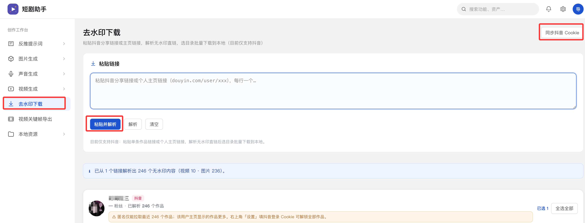
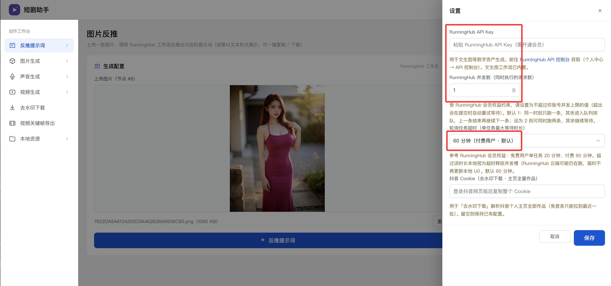
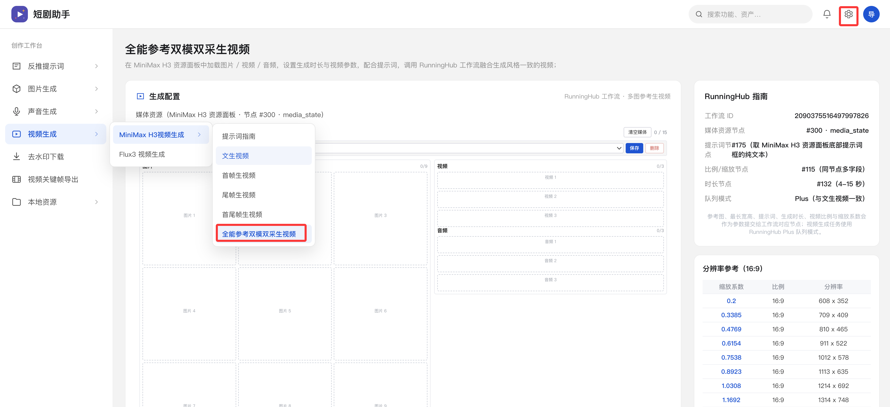
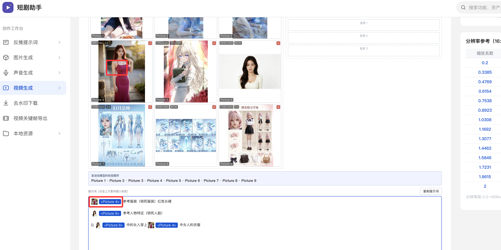

# 短剧助手 (Short Drama Assistant)

免费开源软件，本地运行的 Web 应用，面向**短剧 / AI 视频创作**工作流；集成 RunningHub 工作流做 AI 图片/视频/音频生成

内置抖音单个作品/主页列表/收藏夹无水印下载器。

支持抽关键帧以及本地图片/视频资源预览管理

## 界面使用说明

**去水印下载**

网页登录抖音后点击 右上角 同步抖音cookiea按钮后就可以正常解析下载无水印视频


**设置**

图片/视频/音频都是调用Runninghub的定制工作流，需要注册账号登陆后填进去

对于老用户直接 https://www.runninghub.cn/call-api 获取密钥填入设置里面

对于新用户点击下面注册送500币

注册地址：https://www.runninghub.cn?inviteCode=3493ffd7

注意关注用户权益修改并发数量



**MiniMax H3 生视频**

支持MiniMax H3 文生视频、图生视频、首尾帧生视频、全能参考

支持MiniMax 双模双采放大，人物脸不崩，并且质量高清



**MiniMax H3 生视频（2）**

上传的图片支持点击按标签的形式输入到提示框

对于写好的提示词推荐使用workbuddy 安装prompt-writing skill 优化提示词，免费！！

工作流内有付费节点我都给踢出掉了，运行只扣runninghub 的 币



**特别说明：**

```

这个开源项目不参与任何扣费，纯粹调用runninghub 的api，你在Runninghub的

控制台：https://www.runninghub.cn/call-api/bill-task

可以看到当前执行的任务，也可以取消任务,取消不扣币

后续开发迭代会考虑ComfyUI版本的本地化的无线画布和Flux3 Krea3相关图片视频生成功能，具体等有机会在开发..

```

## 快速开始

```
# 1. 安装下载器依赖

git clone https://github.com/lanyan520/Short-Drama-Assistant.git

pip install -r downloader/requirements.txt

# 2. 启动主服务(端口自己定义，参考port=8777)

port=8777 python3 server.py

# 3.浏览器打开 http://127.0.0.1:8777

```

## 许可证

本项目以 MIT 许可证开源（详见 `LICENSE`）。下载器子项目遵循其自身许可证。
